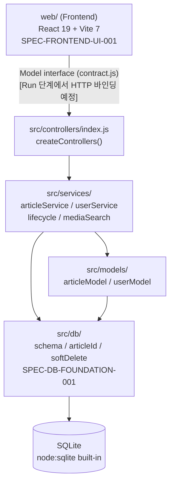

# Architecture Codemap — 기사 작성기

SPEC 구현 현황 및 파일별 역할 매핑.

## 계층 의존 관계



## 파일별 역할 및 SPEC 매핑

### DB 계층 (`src/db/`) — SPEC-DB-FOUNDATION-001

| 파일 | 역할 | 핵심 exports |
|------|------|-------------|
| `schema.js` | 테이블 DDL + 상수 정의 | `createSchema`, `ARTICLE_COLUMNS`, `CONTENTS_COLUMNS`, `USER_COLUMNS`, `LIFECYCLE_STATUSES`, `KILL_STATUSES` |
| `articleId.js` | 기사 ID 생성기 | `generateArticleId`, `formatArticleId` |
| `softDelete.js` | 소프트 삭제 실행기 | `softDeleteArticle` |

테이블 구조:

- **Article** (PK=articleId): articleId, title, content, markupVersion, modifier — 모든 컬럼 VARCHAR
- **Contents** (PK=articleId): 위 컬럼 + author, sender, department, departmentCode, createdAt, editedAt, sentAt, distributedAt, embargoAt, secondEmbargoAt, status — 모든 컬럼 VARCHAR
- **User** (PK=userId): userId, name, password, role, department, departmentCode — 모든 컬럼 VARCHAR

기사 ID 형식: `AKR` + `YYYYMMDD` + 9자리 0-패딩 난수 = 총 20자. 충돌 시 난수 부분 재생성.

### 백엔드 계층 (`src/models/`, `src/services/`, `src/controllers/`) — SPEC-BACKEND-CORE-001

| 파일 | 역할 | 핵심 exports |
|------|------|-------------|
| `models/articleModel.js` | Article/Contents SQL 전담 | `createArticleModel` |
| `models/userModel.js` | User SQL 전담 | `createUserModel` |
| `services/articleService.js` | 기사 CRUD + 생애주기 오케스트레이션 | `createArticleService` |
| `services/userService.js` | 사용자 CRUD + 로그인 | `createUserService` |
| `services/lifecycle.js` | 생애주기 순수 함수 | `transition`, `canEdit` |
| `services/mediaSearch.js` | 미디어 검색 프록시 | `createMediaSearchService` |
| `controllers/index.js` | 요청→서비스 위임 | `createControllers` |

`createControllers(db, deps)` 반환 형태:

```js
{
  article: { create, query, search, updateStatus, remove, applyAction },
  user:    { create, query, update, remove, login },
  media:   { search },
}
```

### 프런트엔드 계층 (`web/`) — SPEC-FRONTEND-UI-001

| 경로 | 역할 |
|------|------|
| `src/model/contract.js` | Model 인터페이스 계약 + `assertModel` 가드 |
| `src/model/editorAdapter.js` | 에디터 어댑터 계약 (구체 라이브러리 미구현) |
| `src/view/TopBar.jsx` | 상단 바 (로그인 사용자 정보 표시) |
| `src/view/LoginPage.jsx` | 로그인 페이지 |
| `src/view/WritePage.jsx` | 기사 작성 페이지 (에디터 + 메타데이터, Z권한 송고/보류/KILL 버튼 포함) |
| `src/view/ViewPage.jsx` | 기사 조회 페이지 |
| `src/view/ContextMenu.jsx` | 우클릭 컨텍스트 메뉴 (상세보기 진입) |
| `src/view/InlineEmbed.jsx` | 본문 인라인 임베드 컴포넌트 (캐럿 위치 삽입 + persist, SPEC-NEWS-REVISE-001 AC-EMB-INLINE-1·2·3) |
| `src/view/articleDetail.js` | 상세보기 HTML 빌더 (`buildArticleDetailHtml`, 제목/본문 분리 + 공통정보 12필드) |
| `src/view/editorNewline.js` | Enter 줄바꿈 핸들러 + IME 합성 가드 (plan.md D-7, AC-IME-1·2) |
| `src/view/editorShortcuts.js` | 단축키 핸들러: `Ctrl+D` 라인 삭제, `Alt+Y` "(끝)" 삽입 |
| `src/view/editorCaret.js` | 캐럿 위치 보정 (M3 임베드 모델) |
| `src/view/editorColoring.js` | 에디터 구문 강조 |
| `src/view/clipboardEmbed.js` | 클립보드 이미지 임베드 (10%×10%) |
| `src/controller/useLoginController.js` | 로그인 상태·액션 |
| `src/controller/useWriteController.js` | 기사 작성 상태·액션 |
| `src/controller/useViewController.js` | 기사 조회 상태·액션 |
| `src/controller/useSearchController.js` | 미디어/글기사 검색 |
| `src/app/App.jsx` | Model 주입, 세션 상태, 클라이언트 라우팅, 인증 가드 |
| `src/app/context.js` | ModelContext, SessionContext |
| `src/test/fakeModel.js` | 테스트용 주입 Fake Model |

## 생애주기 상태 전이표

| (state, role, action) | 결과 상태 | 비고 |
|-----------------------|-----------|------|
| RDS + R + send | RDS | 기자 송고 |
| RDS + R + hold | RRH | 기자 보류 |
| RDS + R + kill | RRK | 기자 KILL (소프트 삭제) |
| RDS + D + send | DPS | 데스크 송고 |
| RDS + D + hold | DDH | 데스크 보류 |
| RDS + D + kill | DDK | 데스크 KILL (소프트 삭제) |
| RDS + Z + send | DPS | 관리자 송고 (D-mirror, SPEC-NEWS-REVISE-001 AC-Z-LIFECYCLE-1) |
| RDS + Z + hold | DDH | 관리자 보류 (D-mirror) |
| RDS + Z + kill | DDK | 관리자 KILL (D-mirror, 소프트 삭제) |
| 기타 모든 조합 | 거부 (`{ ok: false }`) | |

`canEdit(state, role, action)`: `DPS` 상태 + 고침/포털고침 액션이면 D 권한만 허용; 나머지는 R/D/Z 모두 허용.

Z 권한 전이는 `lifecycle.js` TRANSITIONS 매트릭스와 `articleService.js` `KILL_BY_ROLE` 셋에 `Z`를 포함하여 구현한다 (plan.md Decision Lock D-6).

## 인증 역할

| 코드 | 역할 | 권한 |
|------|------|------|
| R | 기자(리포터) | 기사 작성·송고·보류·KILL |
| D | 데스크 | 기사 편집, DPS 상태 기사 고침/포털고침 |
| Z | 관리자 | 기사 편집 가능 |

비밀번호 해싱: `bcryptjs` (서버사이드, 해시는 API 응답에 포함되지 않음).

## Model 인터페이스 계약 (프런트엔드)

`src/model/contract.js`에 정의된 8개 메서드가 전부 구현되어야 한다.

| 메서드 | 목적 | 구현 상태 |
|--------|------|-----------|
| `login(userId, password)` | 인증 | 인터페이스 정의됨 |
| `queryUsers(filters)` | 부서 데이터 소스 | 인터페이스 정의됨 |
| `queryArticles(filters)` | 기사 목록 조회 | 인터페이스 정의됨 |
| `searchArticles(queryText)` | 내부 글기사 검색 | 인터페이스 정의됨 |
| `searchMedia(query)` | 미디어 검색 (YouTube→Google) | 인터페이스 정의됨 |
| `applyAction(articleId, role, action)` | 생애주기 액션 적용 | 인터페이스 정의됨 |
| `saveArticle(articleId, dto)` | 기사 DTO 저장 | 인터페이스 정의됨 |
| `subscribe(filter, onChange)` | 실시간 구독 | 인터페이스 정의됨; 전송 미구현 (예정) |

## Run 단계 미구현 항목 (미구현/예정)

- REST API HTTP 바인딩 (controllers는 callable 함수로만 존재)
- YouTube / Google API 실제 HTTP 호출 (환경변수 `YOUTUBE_API_KEY`, `GOOGLE_API_KEY`, `GOOGLE_SEARCH_CX` 필요)
- `subscribe` 실시간 전송 (WebSocket 또는 SSE)
- 구체적인 에디터 라이브러리 (`editorAdapter.js` 계약 정의됨)

## 테스트 커버리지 현황

| 계층 | 러너 | 테스트 파일 | 테스트 수 |
|------|------|-------------|-----------|
| DB + 백엔드 (통합) | node:test | `test/*.test.js` (7개) | 73개 |
| 프런트엔드 | Vitest | `web/src/**/*.test.*` | 28개 |
