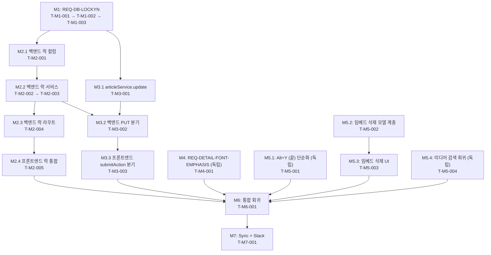

# Task Decomposition — SPEC-NEWS-REVISE-002

SPEC: SPEC-NEWS-REVISE-002
Methodology: TDD (RED-GREEN-REFACTOR) — `.moai/config/sections/quality.yaml`
Generated: 2026-06-03

본 분해는 spec.md §4의 7개 REQ + acceptance.md §1~§7의 30개 AC + §8의 5개 NFR을 atomic task 18개로 분해한다. 각 task는 단일 RED-GREEN-REFACTOR 사이클(단일 commit) 완결을 목표로 한다.

---

## Task Table

| Task ID | Description | REQ | AC | Dependencies | Planned Files | Test Files | Status |
|---------|-------------|-----|----|--------------|---------------|------------|--------|
| T-M1-001 | `Contents` 테이블에 `lockYN VARCHAR NOT NULL DEFAULT 'N'` 컬럼 추가 + `CONTENTS_COLUMNS` Object.freeze 배열에 `'lockYN'` 항목 추가 + 기존 DB 호환 `ensureContentsLockYNColumn(db)` PRAGMA/ALTER 헬퍼 (ensureUserActiveColumn 패턴 재사용) | REQ-DB-LOCKYN | AC-LOCKYN-1 | — | `src/db/schema.js` | `test/schema.test.js` | pending |
| T-M1-002 | `articleModel.insert`의 Contents INSERT SQL에 `lockYN` 컬럼/플레이스홀더 추가 (`data.lockYN ?? 'N'` 기본값) + `findById`/`query` 결과에 `lockYN` 포함 검증 (SELECT * 자동 포함) | REQ-DB-LOCKYN | AC-LOCKYN-2, AC-LOCKYN-3 | T-M1-001 | `src/models/articleModel.js` | `test/articleService.test.js` | pending |
| T-M1-003 | `test/schema.test.js` `AC-1: Contents has expected columns` deepEqual 단언을 16 컬럼(lockYN 추가)으로 갱신 + AC-LOCKYN-1/2/3 신규 단언 (PRAGMA table_info 검증, default 'N', insert/findById round-trip) | REQ-DB-LOCKYN | AC-LOCKYN-1, AC-LOCKYN-2, AC-LOCKYN-3 | T-M1-001, T-M1-002 | `test/schema.test.js`, `ContentsVO.md` | `test/schema.test.js` | pending |
| T-M2-001 | `schema.js`에 `lockerUserId`/`lockerSessionId`/`lockedAt` VARCHAR (NULL 허용) 컬럼 추가 + `CONTENTS_COLUMNS` 갱신 + `CREATE_CONTENTS` DDL 변경 + 기존 DB 호환 ALTER 헬퍼 (D2-2 옵션 A 채택) | REQ-EDIT-LOCK | AC-LOCKYN-1, AC-EDIT-LOCK-1 | T-M1-001 | `src/db/schema.js`, `src/models/articleModel.js` | `test/schema.test.js` | pending |
| T-M2-002 | `articleService.acquireEditLock(articleId, { userId, sessionId, now, timeoutMs })` 신규 — 단일 SQL `UPDATE Contents SET lockYN='Y', lockerUserId=?, lockerSessionId=?, lockedAt=? WHERE articleId=? AND (lockYN='N' OR lockedAt < ?)` (race-safe atomic) + `info.changes === 1` 성공 반환 + 좀비 락 30분 자동 해제 (D2-3 옵션 A) + sessionId 비교로 동일 사용자 다른 페이지 거부 (D2-5 옵션 A) | REQ-EDIT-LOCK | AC-EDIT-LOCK-1, AC-EDIT-LOCK-2, AC-EDIT-LOCK-3, AC-EDIT-LOCK-5, AC-EDIT-LOCK-7 | T-M2-001 | `src/services/articleService.js` | `test/articleService.test.js` (acquireEditLock 단위 + 통합) | pending |
| T-M2-003 | `articleService.releaseEditLock(articleId, { userId, sessionId })` — 보유자 검증 후 `lockYN='N'`, locker 컬럼 NULL + `assertLockHolder(articleId, { userId, sessionId })` 신규 + `applyAction`에 락 보유자 검증 통합 (락 보유자 아닌 호출 거부, reason 'lock-required') | REQ-EDIT-LOCK | AC-EDIT-LOCK-3, AC-EDIT-LOCK-6 | T-M2-002 | `src/services/articleService.js` | `test/articleService.test.js` (releaseEditLock + applyAction 락 검증) | pending |
| T-M2-004 | `server/index.js`에 `POST /api/articles/:id/lock` (acquire) / `DELETE /api/articles/:id/lock` (release) 엔드포인트 신규 — 세션에서 userId/sessionId 추출 (클라이언트 사칭 금지 NFR-SEC) + `web/src/model/contract.js` `MODEL_KEYS`에 `acquireEditLock`/`releaseEditLock` 추가 + `httpModel`에 두 메서드 구현 (해제는 `sendBeacon` 호환 페이로드) | REQ-EDIT-LOCK | AC-EDIT-LOCK-1, AC-EDIT-LOCK-2, AC-EDIT-LOCK-3 | T-M2-003 | `server/index.js`, `web/src/model/contract.js`, `web/src/model/httpModel.js` | `web/src/model/httpModel.test.js` | pending |
| T-M2-005 | `useWriteController.js`의 `editArticleId` `useEffect`에서 `model.acquireEditLock` 호출 — 성공 시 진입 / 실패 시 `lockError` state 설정 + cleanup에서 `releaseEditLock` 호출 + 모듈 마운트 시 `beforeunload` / `visibilitychange:hidden` 리스너 등록 → `navigator.sendBeacon('/api/articles/:id/lock', payload, 'DELETE')` (D2-4 옵션 C 이중 채널) + `WritePage.jsx`에 `lockError` 발생 시 ALERT(blocking) + inline 배너(aria-live="assertive") 동시 표시 (D2-1 옵션 C) + 편집 영역 비활성화 | REQ-EDIT-LOCK | AC-EDIT-LOCK-2, AC-EDIT-LOCK-4, AC-EDIT-LOCK-5, NFR-A11Y | T-M2-004 | `web/src/controller/useWriteController.js`, `web/src/view/WritePage.jsx` | `web/src/controller/useWriteController.editLoad.test.jsx`, `web/src/view/WritePage.test.jsx` | pending |
| T-M3-001 | `articleService.update(articleId, dto)` 신규 — markupVersion + 변경된 Contents 필드만 부분 업데이트 (D2-7 옵션 A) + `articleModel.update(articleId, fields)` 신규 (UPDATE Article + UPDATE Contents SET col=?, ... WHERE articleId=?) + lifecycle.js TRANSITIONS 변경 없음 회귀 가드 (AC-API-5) | REQ-API-INSERT-UPDATE-SPLIT | AC-API-2, AC-API-3, AC-API-5 | T-M1-002 | `src/services/articleService.js`, `src/models/articleModel.js` | `test/articleService.test.js` (update 단위) | pending |
| T-M3-002 | `server/index.js`의 `PUT /api/articles/:id` 핸들러를 `controllers.article.create` → `controllers.article.update`로 분기 + `controllers/index.js` `article.update` 핸들러 신규 노출 + 세션 인가 (R/D/Z) 유지 + 락 보유자 자동 검증 (T-M2-003 assertLockHolder 호출) | REQ-API-INSERT-UPDATE-SPLIT, REQ-EDIT-LOCK | AC-API-2, AC-EDIT-LOCK-6 | T-M3-001, T-M2-003 | `server/index.js`, `src/controllers/index.js` | `test/serverAuthWiring.test.js` (PUT 분기) | pending |
| T-M3-003 | `useWriteController.submitAction` 컨텍스트 분기 명시화 — `articleId === 'A-DRAFT'` → `model.saveArticle('A-DRAFT', dto)` (POST→articleInsert) / 편집 컨텍스트 → `model.saveArticle(articleId, dto)` (PUT→articleUpdate). 제목 없음 ALERT 회귀 유지 (AC-API-4) + send/hold/kill 모두 분기 적용 | REQ-API-INSERT-UPDATE-SPLIT | AC-API-1, AC-API-2, AC-API-3, AC-API-4 | T-M3-002 | `web/src/controller/useWriteController.js` | `web/src/controller/useWriteController.test.jsx`, `web/src/controller/useWriteController.editLoad.test.jsx` | pending |
| T-M4-001 | `articleDetail.js` 미커밋 변경 흡수 (`.yh-detail__title 1.3rem`, `.yh-detail__content 1.75rem` 그대로 유지) + `articleDetail.test.js`에 AC-FONT-1 (CSS 룰 정규식 비교, 본문 > 제목) 단언 갱신 + AC-FONT-2 (선택 — getComputedStyle fallback) + AC-FONT-3 (빈 제목 `(제목 없음)` 케이스에서도 폰트 관계 유지) + AC-FONT-4 (SPEC-NEWS-REVISE-001 AC-DTL-1~6 회귀 통과 명시) | REQ-DETAIL-FONT-EMPHASIS | AC-FONT-1, AC-FONT-2, AC-FONT-3, AC-FONT-4, NFR-DESIGN | — | `web/src/view/articleDetail.js`, `web/src/view/articleDetail.test.js` | `web/src/view/articleDetail.test.js` | pending |
| T-M5-001 | `editorContent.js`의 `END_MARKER_BLOCK = '\n (끝)'`을 `'(끝)'`로 단순화 (prefix CRLF/공백 제거) + `hasEndMarker` 검증 보강 + `editorAdapter.test.js` / `editorContent.test.js` / `editorColoring.test.js` / `WritePage.test.jsx`의 단언 일괄 갱신 (`'본문\n (끝)'` → `'본문(끝)'`) + **SPEC-NEWS-REVISE-001 AC-CTRL-D-5의 단언 문자열을 `"(끝)"`로 동기 갱신** (REQ-EDITOR-END-MARKER 의도 정합) | REQ-EDITOR-END-MARKER | AC-ENDMARK-1, AC-ENDMARK-2, AC-ENDMARK-3, AC-ENDMARK-4 | — | `web/src/model/editorContent.js`, `web/src/model/editorAdapter.js` (주석만), `web/src/view/editorColoring.js` (필요시) | `web/src/model/editorContent.test.js`, `web/src/model/editorAdapter.test.js`, `web/src/view/editorColoring.test.js`, `web/src/view/WritePage.test.jsx` | pending |
| T-M5-002 | `editorContent.js`에 `removeEmbedById(content, embedId)` 신규 (인접 텍스트/임베드 보존하며 단일 embed 블록 제거) + `editorAdapter.removeEmbed(embedId)` 어댑터 메서드 추가 + `useWriteController.removeEmbed(embedId)` 노출 + markup round-trip 가드 (`removeEmbed` → `getMarkup` → `setMarkup` → embeds.length === before - 1) | REQ-EMBED-DELETE | AC-EMB-DEL-3 | — | `web/src/model/editorContent.js`, `web/src/model/editorAdapter.js`, `web/src/controller/useWriteController.js` | `web/src/model/editorContent.test.js`, `web/src/model/editorAdapter.test.js`, `web/src/controller/useWriteController.test.jsx` | pending |
| T-M5-003 | `InlineEmbed.jsx`에 × 어포던스 button (hover/focus 시 표시, `aria-label="임베드 삭제"`) 추가 + `onDelete` prop 도입 + `WritePage.jsx` BodyEditor `onKeyDown`에 임베드 노드 focus 상태에서 Backspace 핸들러 추가 (D2-6 옵션 C — × 버튼 + Backspace 둘 다) + 인접 보존 (AC-EMB-DEL-2) + SPEC-NEWS-REVISE-001 AC-EMB-1~3 회귀 가드 (AC-EMB-DEL-4) | REQ-EMBED-DELETE | AC-EMB-DEL-1, AC-EMB-DEL-2, AC-EMB-DEL-4, AC-EMB-DEL-5, NFR-A11Y | T-M5-002 | `web/src/view/InlineEmbed.jsx`, `web/src/view/WritePage.jsx` | `web/src/view/InlineEmbed.test.jsx`, `web/src/view/WritePage.test.jsx` | pending |
| T-M5-004 | `mediaSearch.js`/`articleService.searchArticles` 회귀 가드 신규 — Youtube provider success → Google 미호출 (AC-SEARCH-1), Youtube fail OR empty → Google fallback (AC-SEARCH-2, D2-8 옵션 B — 기존 동작 잠금), 글기사 탭 내부 검색 호출 검증 (AC-SEARCH-3 — articleService.searchArticles 단언), 응답 페이로드에 API 키 비노출 (AC-SEARCH-4). **mediaSearch.js 코드 변경 없음 — 테스트만 추가** | REQ-SEARCH-YOUTUBE-API | AC-SEARCH-1, AC-SEARCH-2, AC-SEARCH-3, AC-SEARCH-4, NFR-SEC | — | (none) | `test/mediaSearch.test.js` (회귀 보강), `test/articleService.test.js` (searchArticles 단언) | pending |
| T-M6-001 | 통합 회귀 — `npm test` (백엔드) + `npm run test:web` (프론트) + `npm run build` (Vite 무경고) 통과 + SPEC-NEWS-REVISE-001 AC-Z-1~5 / AC-DTL-1~6 / AC-EMB-1~3 / AC-CTRL-D-1~5 (단 AC-CTRL-D-5는 T-M5-001로 단언 갱신됨) 회귀 GREEN 재확인 + `news.md` / `ContentsVO.md` 미커밋 변경 commit (CLAUDE.md HARD: 한국어/UTF-8) + TRUST 5 self-check | (전체 7 REQ) | NFR-REG, NFR-PERF, NFR-SEC | T-M1-001~T-M5-004 (전체) | (test runs only) | (전체 테스트 파일 통합 실행) | pending |
| T-M7-001 | `/moai sync SPEC-NEWS-REVISE-002` 실행 (manager-docs 위임) — `.moai/specs/SPEC-NEWS-REVISE-002` 정합 확인 + 본 SPEC commit 메시지에 `SPEC-NEWS-REVISE-002` / REQ-* / AC-* ID 포함 + **Slack `tech-day` 채널 (ID `C0B69CG59UM`) 작업 완료 보고** (CLAUDE.md HARD 규칙 — Orchestrator 권한) | (전체 7 REQ) | (Definition of Done 전체) | T-M6-001, 사용자 게이트 | `.moai/specs/SPEC-NEWS-REVISE-002/*` (lifecycle 'spec-anchored' 유지) | (manual verification) | pending |

---

## AC 매핑 검증

총 acceptance.md AC 수: **30** (AC-LOCKYN-1~3 = 3, AC-EDIT-LOCK-1~7 = 7, AC-API-1~5 = 5, AC-FONT-1~4 = 4, AC-ENDMARK-1~4 = 4, AC-EMB-DEL-1~5 = 5, AC-SEARCH-1~4 = 4) + NFR 5종 (NFR-A11Y, NFR-DESIGN, NFR-REG, NFR-PERF, NFR-SEC)

매핑된 AC 수: **30 / 30** (NFR 5 / 5 포함)

| AC ID | 매핑된 Task ID |
|-------|----------------|
| AC-LOCKYN-1 | T-M1-001, T-M1-003, T-M2-001 |
| AC-LOCKYN-2 | T-M1-002, T-M1-003 |
| AC-LOCKYN-3 | T-M1-002, T-M1-003 |
| AC-EDIT-LOCK-1 | T-M2-002, T-M2-004 |
| AC-EDIT-LOCK-2 | T-M2-002, T-M2-004, T-M2-005 |
| AC-EDIT-LOCK-3 | T-M2-002, T-M2-003, T-M2-004 |
| AC-EDIT-LOCK-4 | T-M2-005 |
| AC-EDIT-LOCK-5 | T-M2-002, T-M2-005 |
| AC-EDIT-LOCK-6 | T-M2-003, T-M3-002 |
| AC-EDIT-LOCK-7 | T-M2-002 |
| AC-API-1 | T-M3-003 |
| AC-API-2 | T-M3-001, T-M3-002, T-M3-003 |
| AC-API-3 | T-M3-001, T-M3-003 |
| AC-API-4 | T-M3-003 |
| AC-API-5 | T-M3-001 |
| AC-FONT-1 | T-M4-001 |
| AC-FONT-2 | T-M4-001 |
| AC-FONT-3 | T-M4-001 |
| AC-FONT-4 | T-M4-001 |
| AC-ENDMARK-1 | T-M5-001 |
| AC-ENDMARK-2 | T-M5-001 |
| AC-ENDMARK-3 | T-M5-001 |
| AC-ENDMARK-4 | T-M5-001 |
| AC-EMB-DEL-1 | T-M5-003 |
| AC-EMB-DEL-2 | T-M5-003 |
| AC-EMB-DEL-3 | T-M5-002 |
| AC-EMB-DEL-4 | T-M5-003 |
| AC-EMB-DEL-5 | T-M5-003 |
| AC-SEARCH-1 | T-M5-004 |
| AC-SEARCH-2 | T-M5-004 |
| AC-SEARCH-3 | T-M5-004 |
| AC-SEARCH-4 | T-M5-004 |
| NFR-A11Y | T-M2-005, T-M5-003 |
| NFR-DESIGN | T-M4-001 |
| NFR-REG | T-M6-001 |
| NFR-PERF | T-M2-002 (단일 UPDATE), T-M2-005 (sendBeacon) |
| NFR-SEC | T-M2-003, T-M2-004, T-M5-004 |

누락 AC 목록: **없음**

---

## 마일스톤 의존 그래프 (Mermaid)

---

## 병렬 가능 마일스톤

| 사이클 | 병렬 실행 Task | 비고 |
|--------|----------------|------|
| 사이클 1 | T-M1-001, T-M4-001, T-M5-001, T-M5-004 | 4 독립 트랙 동시 RED-GREEN-REFACTOR (의존성 없음) |
| 사이클 2 | T-M1-002, T-M1-003 (직렬), T-M5-002 (병렬) | M1 내부 직렬 + M5 모델 계층 병렬 |
| 사이클 3 | T-M2-001, T-M5-003 (병렬) | 락 컬럼 + 임베드 UI 병렬 |
| 사이클 4 | T-M2-002, T-M2-003 (직렬), T-M3-001 (병렬) | 락 서비스 + update 서비스 병렬 |
| 사이클 5 | T-M2-004, T-M3-002 (병렬) | 백엔드 라우트 동시 (server/index.js 충돌 가능 — 직렬화 권고) |
| 사이클 6 | T-M2-005, T-M3-003 (병렬) | 프론트엔드 통합 — useWriteController.js 충돌 가능 (락 useEffect vs submitAction 분기는 코드 영역 분리되어 병렬 가능하나, 같은 commit으로 묶어도 OK) |
| 사이클 7 | T-M6-001 | 통합 회귀 (직렬) |
| 사이클 8 | T-M7-001 | 사용자 게이트 통과 후 sync + Slack |

병렬 실행 권장 사이클: 1, 2, 3, 4. 사이클 5/6은 동일 파일 충돌 가능성으로 직렬 권고.

---

## Pending Decisions (D2-1 ~ D2-8) 권고 요약

본 task 분해는 plan.md §5의 8 Decision Point에 대해 다음 권고를 *전제*로 함. 사용자 승인 후 Run 단계 진행:

| ID | 권고 옵션 | 영향 Task |
|----|----------|-----------|
| D2-1 | (C) 둘 다 — ALERT(blocking) + inline 배너(aria-live) | T-M2-005 |
| D2-2 | (A) locker 컬럼 추가 — race-safe 단일 SQL 가능 | T-M2-001, T-M2-002 |
| D2-3 | (A) 30분 timeout | T-M2-002 |
| D2-4 | (C) 두 채널 모두 sendBeacon | T-M2-005 |
| D2-5 | (A) 거부 (엄격 해석) | T-M2-002, T-M2-005 |
| D2-6 | (C) × 버튼 + Backspace 둘 다 | T-M5-003 |
| D2-7 | (A) markupVersion + 변경된 Contents 필드만 부분 업데이트 | T-M3-001 |
| D2-8 | (B) HTTP 비-2xx OR 빈 결과 둘 다 fallback (**기존 코드 동작 잠금** — plan 추정 (A)와 다름) | T-M5-004 |

---

## Status Legend

- `pending`: 아직 시작하지 않음 (기본값)
- `in-progress`: RED 또는 GREEN 진행 중
- `review`: 사용자 검토 대기
- `done`: GREEN + REFACTOR + 단위 회귀 통과
- `blocked`: 선행 task 미완료 또는 외부 차단

---

Version: 0.1.0
Status: pending (사용자 승인 대기)
